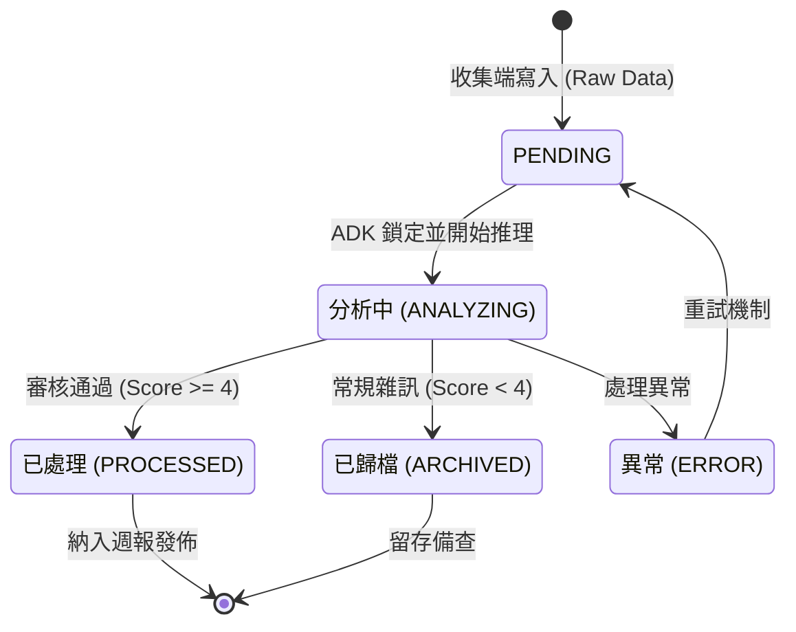

### Day 05：核心資料契約：使用 Pydantic 定義統一 Schema

在昨天順利打通本地環境與 Gemini REST API 連線後，今天我們要著手打造整個情報雷達專案的核心基石——**資料契約（Data Contract）**。

在傳統的 Python 自動化腳本中，很多人習慣用散裝的 `dict`（字典）在各個函式之間傳遞資料。這在玩具專案中看似敏捷，但一旦進入多模組、多代理人（Multi-Agent）系統，就會引發一系列噩夢：

* 某個欄位名稱拼錯（例如 `title` 寫成 `source_title`），程式直到執行數小時後才崩潰。
* 收集端（Spark / Colab）寫入的資料型態不一致（例如評分有時是字串 `"4"`，有時是整數 `4`）。
* 模型生成的 JSON 結構偶爾漏掉必要欄位，導致後續分析流程直接中斷。

要解決這些問題，最佳實踐就是引入 **Pydantic**。

---

**一、 為什麼選擇 Pydantic？**

Pydantic 是現代 Python 開發中最主流的資料解析與驗證套件。它有三大關鍵特性：

1. **執行期型別驗證（Runtime Validation）**：只要資料進來，立刻強制型別校驗與轉換，防呆在最前線。
2. **與 JSON 的雙向無縫互轉**：無論是把試算表列資料轉為 Python 物件，還是把物件序列化給 LLM，都只需一行程式碼。
3. **自我文檔化與 IDE 自動補全**：程式碼編輯器能精確提示欄位屬性，大幅降低開發時的低級人為錯誤。

---

**二、 落地實作：定義核心領域模型**

在專案目錄下建立 `src/core/` 資料夾，並新增 `models.py`。我們將 Day 03 所規劃的「核心定死、彈性留活」架構完全轉換為程式碼 (符合 Pydantic V2 與 Python 3.13 規範 的現代化寫法)：

```python
# src/core/models.py
from datetime import datetime, timezone
from enum import Enum
from typing import Any, Dict, Optional
import uuid
from pydantic import BaseModel, ConfigDict, Field


class ItemStatus(str, Enum):
    """狀態機生命週期定義"""
    PENDING = "PENDING"          # 收集端剛寫入，等待處理
    ANALYZING = "ANALYZING"      # ADK 正在分析審核中 (鎖定狀態)
    PROCESSED = "PROCESSED"      # 審核通過 (>= 4分)，納入發布週報
    ARCHIVED = "ARCHIVED"        # 常規雜訊 (< 4分)，歸檔留存
    ERROR = "ERROR"              # 處理異常


class DomainType(str, Enum):
    """一級領域分類"""
    SCIENCE = "SCIENCE"
    FINANCE = "FINANCE"
    COMMUNITY = "COMMUNITY"


class IntelligenceItem(BaseModel):
    """
    情報條目核心資料契約 (Data Contract)
    貫穿整個收集端、Google Sheets 資料庫與 ADK 推理層。
    """
    # 採用 Pydantic V2 推薦的 ConfigDict
    model_config = ConfigDict(
        use_enum_values=True,
        validate_assignment=True
    )

    # 1. 系統骨架欄位 (不可變)
    entry_id: str = Field(
        default_factory=lambda: str(uuid.uuid4())[:8],
        description="條目唯一識別碼"
    )
    timestamp: datetime = Field(
        # 採用 Python 3.12+ 推薦的 timezone-aware UTC 寫法
        default_factory=lambda: datetime.now(timezone.utc),
        description="收集入庫時間 (UTC)"
    )
    status: ItemStatus = Field(
        default=ItemStatus.PENDING,
        description="當前狀態機節點"
    )

    # 2. 路由分類與來源
    domain: DomainType = Field(description="主領域")
    track: str = Field(description="子軌道標籤，例如 AI_Frontier、Macro_Econ")
    source_title: str = Field(min_length=3, description="標題")
    source_url: str = Field(description="原始連結")

    # 3. 收集端提煉內容
    raw_content: str = Field(description="核心摘要或論點")
    metrics: Optional[str] = Field(default=None, description="關鍵數據表現")
    limitations: Optional[str] = Field(default=None, description="潛在風險或侷限")
    raw_score: int = Field(ge=1, le=5, description="收集端給予的初級評分 (1-5)")

    # 4. ADK 多代理人推演後的落實欄位
    verified_score: Optional[int] = Field(
        default=None, ge=1, le=5, description="審核員校準後的最終評分"
    )
    editorial_summary: Optional[str] = Field(
        default=None, description="資深編輯精煉後的決策層摘要"
    )
    cross_impact_notes: Optional[str] = Field(
        default=None, description="跨領域推演關聯筆記"
    )

    # 5. 彈性預留槽 (擴充關鍵)
    metadata: Dict[str, Any] = Field(
        default_factory=dict,
        description="以字典儲存特定信源專屬的擴充屬性"
    )
```

對應的條目生命週期狀態圖 (State Diagram) 是



---

**三、 撰寫單元測試：驗證資料邊界與防呆**

在 `tests/` 目錄下建立 `test_models.py`，驗證這個資料模型是否能抵禦不合法輸入：

```python
# tests/test_models.py
import pytest
from pydantic import ValidationError
from src.core.models import IntelligenceItem, ItemStatus, DomainType


def test_valid_item_creation():
    """測試正常建立條目"""
    item = IntelligenceItem(
        domain=DomainType.SCIENCE,
        track="AI_Frontier",
        source_title="Scaling State Space Models to 100B Parameters",
        source_url="https://arxiv.org/abs/xxxx.xxxxx",
        raw_content="提出新型硬體感知 Mamba 架構，推論顯存大幅降低...",
        raw_score=4,
        metadata={"arxiv_id": "2609.12345", "authors": ["Alice", "Bob"]}
    )

    assert item.status == ItemStatus.PENDING
    assert item.raw_score == 4
    assert len(item.entry_id) == 8
    assert item.metadata["arxiv_id"] == "2609.12345"


def test_invalid_score_boundary():
    """測試評分越界防呆 (必須在 1-5 之間)"""
    with pytest.raises(ValidationError):
        IntelligenceItem(
            domain=DomainType.FINANCE,
            track="Macro_Econ",
            source_title="US 10Y Yield Jumps",
            source_url="https://bloomberg.com/...",
            raw_content="殖利率上升...",
            raw_score=6  # 故意超出 5 分上限
        )
```

執行測試指令：

```bash
pytest tests/test_models.py
```

若全部亮起綠燈（PASSED），代表我們的通用資料契約已經堅固就位。

---

**今日小結與明天預告**

今天我們完成了「第一階段：架構藍圖與環境準備」的最後一塊拼圖。透過 Pydantic 定義的 `IntelligenceItem`，為全系統奠定了不可動搖的強型別資料合約。

明天開始，我們將正式邁入「第二階段：前端邊緣收集與工作空間」！
在 **Day 06** 中，我們將親自設定 **Gemini Spark** 的 Skill 與 Schedule，讓它化身為全天候的產經與論文前哨巡邏兵！